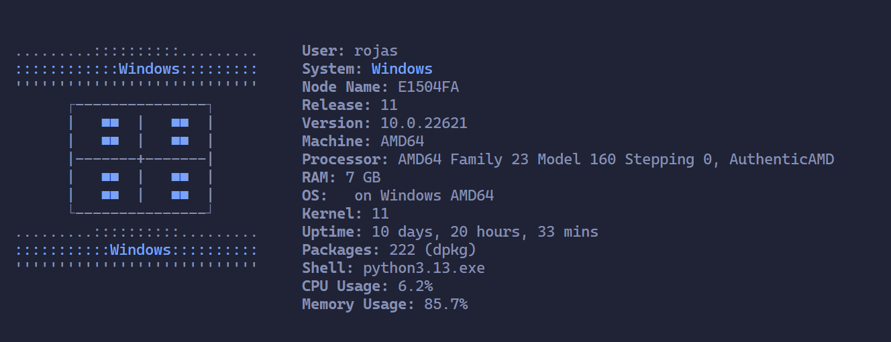

# Proyecto de Simulación de Neofetch


<!--  -->

## Descripción

Este proyecto es una aplicación de consola que simula el comportamiento de la herramienta `neofetch`, mostrando información del sistema operativo y hardware de la máquina en la que se ejecuta. Además, incluye funcionalidades adicionales como un sistema de login y registro de usuarios, y una calculadora básica.

## Características

- **Simulación de Neofetch**: Muestra información detallada del sistema operativo, hardware y otros datos relevantes.
- **Sistema de Login y Registro**: Permite a los usuarios registrarse y acceder a la aplicación.
- **Calculadora Básica**: Realiza operaciones aritméticas simples.

## Requisitos

- Python 3.x
- Módulos adicionales listados en `requirements.txt`

## Instalación

1. Clona el repositorio en tu máquina local:

   ```bash
   git clone https://github.com/tu_usuario/tu_repositorio.git
   cd tu_repositorio
   ```

2. Crea un entorno virtual (opcional pero recomendado):

   ```bash
   python -m venv venv
   source venv/bin/activate  # En Windows usa `venv\Scripts\activate`
   ```

3. Instala las dependencias necesarias:
   ```bash
   pip install -r requirements.txt
   ```

## Ejecución

Para ejecutar la aplicación, simplemente corre el archivo `app.py`:

```bash
python app.py
```

Si solo deseas ejecutar la simulación de Neofetch:

```bash
python .\modules\simulate_neofetch.py #windows
python /modules/simulate_neofetch.py #linux & mac
```

Si solo deseas ejecutar la calculadora:

```bash
python \modules\calculator.py # windows
python /modules/calculator.py # linus & mac
```

## Uso

Al iniciar la aplicación, verás un menú con las siguientes opciones:

1. **Login**: Inicia sesión con un usuario registrado.
2. **Register**: Registra un nuevo usuario.
3. **Neofetch**: Muestra información del sistema.
4. **Calculator**: Realiza operaciones aritméticas.
5. **Logout**: Cierra la sesión actual.
6. **Exit**: Sale de la aplicación.

## Ejemplo de Salida



## Estructura del Proyecto

- `app.py`: Archivo principal de la aplicación.
- `icons.py`: Contiene los iconos ASCII para diferentes sistemas operativos.
- `colors.py`: Define los colores utilizados en la salida de la consola.
- `requirements.txt`: Lista de dependencias necesarias para el proyecto.
- `README.md`: Este archivo, con la descripción del proyecto.
- `images/`: Carpeta que contiene las imágenes utilizadas en el README.

## Contribuciones

Las contribuciones son bienvenidas. Por favor, abre un issue o un pull request para discutir cualquier cambio que desees realizar.

## Licencia

Este proyecto está bajo la Licencia MIT. Consulta el archivo `LICENSE` para más detalles.
