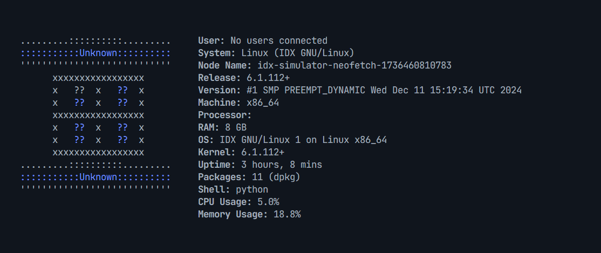

# Neofetch Simulation Project


<!--  -->

## Description

This project is a console application that simulates the behavior of the `neofetch` tool, displaying information about the operating system and hardware of the machine it runs on. Additionally, it includes extra features such as a login and user registration system, and a basic calculator.

## Features

- **Neofetch Simulation**: Displays detailed information about the operating system, hardware, and other relevant data.
- **Login and Registration System**: Allows users to register and access the application.
- **Basic Calculator**: Performs simple arithmetic operations.

## Requirements

- Python 3.x
- Additional modules listed in `requirements.txt`

## Installation

1. Clone the repository to your local machine:

   ```bash
   git clone https://github.com/rojas-oscar/simulator-neofetch.git
   cd simulator-neofetch
   ```

2. Create a virtual environment (optional but recommended):

   ```bash
   python -m venv venv
   source venv/bin/activate  # On Windows use `venv\Scripts\activate`
   ```

3. Install the necessary dependencies:
   ```bash
   pip install -r requirements.txt
   ```

## Execution

To run the application, simply execute the `app.py` file:

```bash
python app.py
```

If you only want to run the Neofetch simulation:

```bash
python .\modules\simulate_neofetch.py #windows
python /modules/simulate_neofetch.py #linux & mac
```

If you only want to run the calculator:

```bash
python \modules\calculator.py # windows
python /modules/calculator.py # linux & mac
```

## Usage

When you start the application, you will see a menu with the following options:

1. **Login**: Log in with a registered user.
2. **Register**: Register a new user.
3. **Neofetch**: Display system information.
4. **Calculator**: Perform arithmetic operations.
5. **Logout**: Log out of the current session.
6. **Exit**: Exit the application.

## Example Output



## Project Structure

- `app.py`: Main application file.
- `icons.py`: Contains ASCII icons for different operating systems.
- `colors.py`: Defines the colors used in the console output.
- `requirements.txt`: List of dependencies required for the project.
- `README.md`: This file, with the project description.
- `images/`: Folder containing the images used in the README.

## Contributions

Contributions are welcome. Please open an issue or a pull request to discuss any changes you wish to make.

## License

This project is under the MIT License. See the `LICENSE` file for more details.
